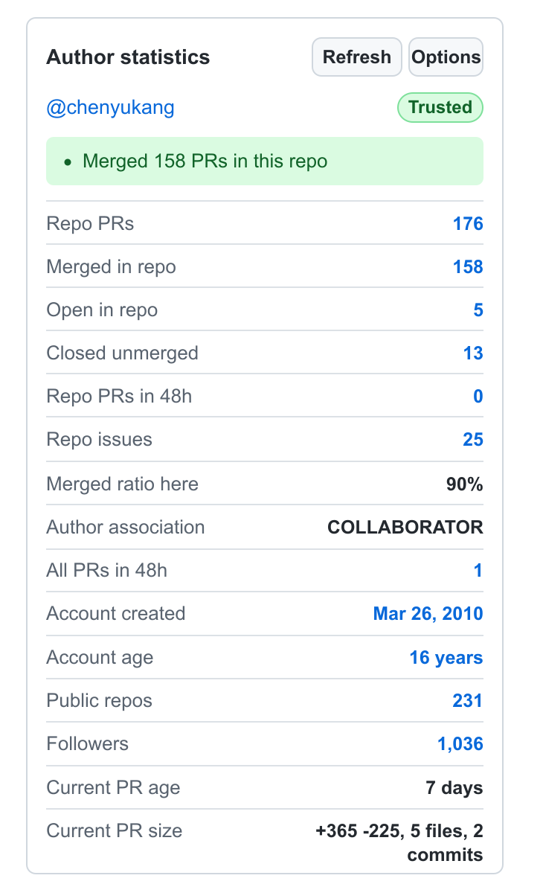

# Meerkat

Chrome MV3 extension that adds an author statistics panel to GitHub pull request pages.

## What It Shows

- PR author history in the current repository: total, merged, open, closed unmerged.
- PRs created by the author across GitHub in the last 48 hours.
- PRs created by the author in the current repository in the last 48 hours.
- Author account creation date, account age, public repositories, followers.
- GitHub `author_association`, current PR age, file count, commit count, additions, and deletions.
- A conservative signal level based on account age, repo history, merged history, bursty PR creation, and current PR size.

Each count links to the matching GitHub search page.

All statistics are visible by default. Open the extension options page to hide individual rows and save that display preference locally.

## Load Locally

1. Open `chrome://extensions`.
2. Enable Developer mode.
3. Choose Load unpacked.
4. Select this directory: `/code/to/to/Meerkat`.
5. Open a PR page such as `https://github.com/rust-lang/rust/pull/155901`.

## GitHub Token

The extension works without a token, but GitHub's unauthenticated API limits are low. Open the extension options and add a GitHub personal access token to get normal authenticated API limits.

For public repositories, the token does not need any scopes. When creating a fine-grained or classic token, leave every scope/permission unchecked unless you want to use it for something outside Meerkat.

The token is stored in `chrome.storage.local`.
